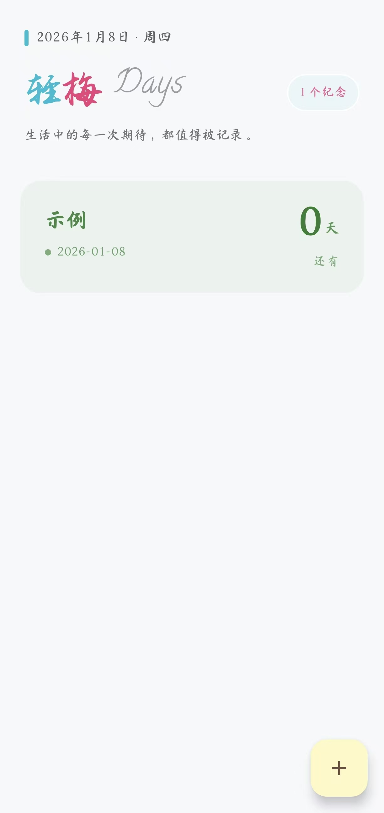
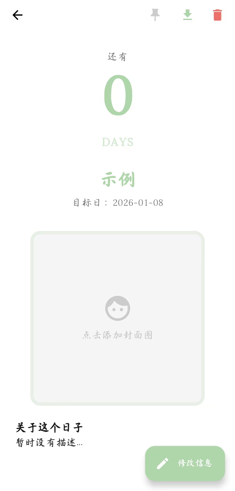
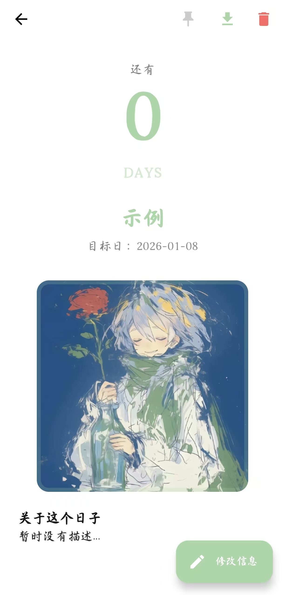
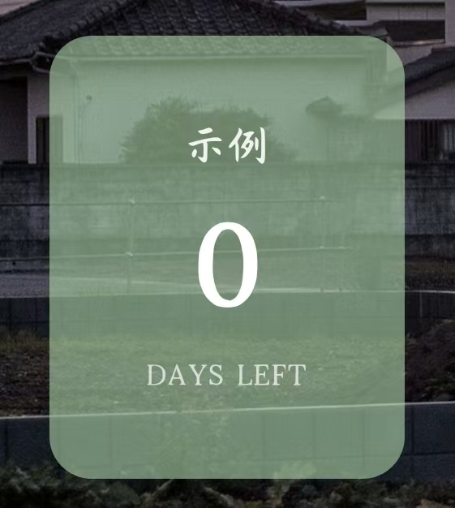

# 轻梅 Days (QingMei Days) 🌸

> **生活中的每一次期待，都值得被记录。** *Every expectation in life is worth recording.*

「轻梅 Days」是一款基于 Jetpack Compose 开发的现代 Android 倒数日应用。它拥有极简而富有艺术感的设计，通过强大的桌面小组件（Widget），让你时刻铭记那些重要的日子。

## ✨ 核心功能 (Features)

- 🎨 **艺术化设计**：采用精心挑选的配色方案与艺术字体。
- 📅 **智能双模式**：
  - **⏳ 提醒模式**：针对临时任务，日子过期后将自动从 App 列表及小组件中消失。
  - **🌸 纪念模式**：针对重要回忆，日子过期后将自动转为“纪念”状态，永久保留并显示已过去的天数。
- 👆 **直觉化交互**：采用卡片式类型选择，点击即选，并伴有细腻的颜色过渡动画。
- 📌 **置顶功能**：重要日子一键置顶，自动同步至桌面小组件。
- 📱 **响应式 Widget**：基于 **Jetpack Glance** 构建，支持零点自动刷新与跨进程同步。s

## 🛠️ 技术栈 (Tech Stack)

- **UI 框架**：[Jetpack Compose](https://developer.android.com/jetpack/compose) (100% Kotlin)
- **桌面组件**：[Jetpack Glance](https://www.google.com/search?q=https://developer.android.com/jetpack/last-guide/ui/app-widgets) (基于 Compose 的 AppWidget 方案)
- **异步处理**：Kotlin Coroutines & Flow
- **数据持久化**：
  - SharedPreferences (App 内部数据)
  - DataStore (Glance 状态管理)
- **序列化**：Gson
- **架构模式**：响应式状态驱动 (State-Driven)

## 🚀 技术亮点：跨进程 Widget 同步机制

本项目解决了一个极具挑战性的技术问题：**App 进程与系统 Widget 进程之间的高效数据同步。**

我们没有采用传统的随机刷新方案，而是构建了一套 **“主动注入式”** 架构：

1. **单向数据流**：App 操作触发 `DataManager` 统一分发数据。
2. **状态注入**：使用 `updateAppWidgetState` 直接将展示数据推送到 Glance 的专用状态机。
3. **版本控制**：通过 `widget_version` 强制触发重组，彻底解决桌面组件不刷新或显示旧数据的顽疾。

详细设计文档请参阅：[`/docs/Glance_Widget_Best_Practices.md`](./docs/Glance_Widget_Best_Practices.md)

## 📸 预览 (Screenshots)

|                   首页列表                   |                           日子详情                           |                   桌面小组件                   |
| :------------------------------------------: | :----------------------------------------------------------: | :--------------------------------------------: |
|  |   |  |

## 📦 快速开始 (Getting Started)

### 环境要求

- Android Studio Ladybug 或更高版本
- JDK 17+
- Android SDK 26+ (Android 8.0+)

### 编译运行

1. 克隆仓库：

   ```
   git clone https://github.com/htllty/QingMeiDays.git
   ```

2. 使用 Android Studio 打开项目。

3. 等待 Gradle 同步完成。

4. 连接真机或模拟器，点击 **Run**。

## 📂 项目结构 (Project Structure)

```
app/
├── src/main/java/com/qingmei/days/
│   ├── components/      # UI 组件与 Widget 实现
│   ├── model/           # 数据模型
│   ├── ui/theme/        # Compose 主题配置
│   ├── utils/           # 数据管理 (DataManager) 与刷新工具
│   └── MainActivity.kt  # 主入口
├── src/main/res/        # 资源文件 (包含艺术字体)
└── docs/                # 技术指南与最佳实践
```

## 💖 鸣谢

感谢所有在项目开发过程中提供灵感与技术支持的朋友。如果你喜欢这个项目，欢迎点一个 **Star** 🌟。

**轻梅 Days** - 让时间拥有温度。